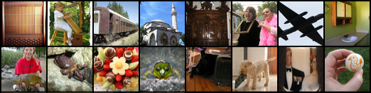
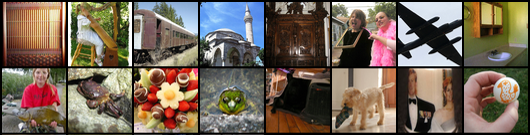

<p align="center">
  <h1 align="middle">Constant Acceleration Flow</h1>
  
  <p align="middle">Dogyun Park, Sojin Lee, Sihyeon Kim, Taehoon Lee, Youngjoon Hong†, Hyunwoo J. Kim†.
  </p>
  <p align="middle">NeurIPS 2024</p>
  <p align="middle">
    <a href="https://www.arxiv.org/abs/2411.00322" target='_blank'></a>
  </p>

</p>

---

This repository is an official implementation of "Constant Acceleration Flow" accepted at NeurIPS 2024.

Constant Acceleration Flow (CAF) introduces a novel ODE framework that models the transformation between two distributions using constant acceleration. 
This approach enables high-quality image generation in a single step. Notably, CAF also achieves high-accuracy single-step inversion, demonstrating its capability to learn precise forward and reverse flows.

## ✅ TODO
- [x] Release training code.
- [x] Release inference (sampling and inversion) code.
- [ ] Release the pre-trained model.


## Results of CAF
### Single-step ImageNet 64x64 generation
<div align="center">
  
</div>
<p align="middle">FID=1.69</p>

### Single-step ImageNet 64x64 reconstruction using inversion
#### Ground Truth
<div align="center">
  
</div>

#### Reconstruction
<div align="center">
  
</div>
<p align="middle">N=1</p>

---

## ⚙️ Enviroment
To install requirements, run:
```bash
git clone https://github.com/mlvlab/CAF.git
cd CAF
conda create -n caf python==3.9
conda activate caf
conda install pytorch==2.2.0 torchvision==0.17.0 torchaudio==2.2.0 pytorch-cuda=11.8 -c pytorch -c nvidia
```

```bash
pip install -e .
```
(RECOMMENDED, linux) Install [PyTorch 2.2.0 with CUDA 11.8](https://pytorch.org/get-started/locally/) for [xformers](https://github.com/facebookresearch/xformers/edit/main/README.md), recommended for memory-efficient computation. 

---

## 🌄 Data Preparation
### Generated data
We have utilized pre-trained [EDM](https://github.com/NVlabs/edm) models to generate deterministic couplings for training our models. To construct deterministic couplings for CIFAR-10 and ImageNet, we selected $N=18$ and
$N=40$, respectively, employing deterministic sampling following the protocol outlined in the EDM repository. For CIFAR-10 and ImageNet, we generated 1M and 3M pairs, respectively, and saved them in `data/` folder as NumPy (.npy) format. 
Each dataset should be organized in the following directory structure:

```
data
|-- cifar10_npy (imagenet_npy)
    |-- z0
        |-- data1.npy
        |-- data2.npy
        |-- ...
    |-- z1
        |-- data1.npy
        |-- data2.npy
        |-- ...
    |-- class
        |-- data1.npy
        |-- data2.npy
        |-- ...
```
It is important to ensure that the z0, z1, and class files correspond to each other by sharing the same filenames. Each triplet (data1.npy in z0, z1, and class) should be aligned to represent a single data pair.

### Real data
We utilized real datasets for adversarial training. You can download ImageNet 64x64 following the download script [here](https://github.com/NVlabs/edm). Place the downloaded dataset in the `data/imagenet` folder.

---

## 🔥🔥 Training
You can update the training config in `flow/script_util.py`.
### Step1. Training initial velocity model
```bash
CUDA_VISIBLE_DEVICES=0,1,2,3,4,5,6,7 accelerate launch --multi_gpu --num_processes=8 \
    script/caf_train_vel.py
```

### Step2. Training acceleration model
```bash
CUDA_VISIBLE_DEVICES=0,1,2,3,4,5,6,7 accelerate launch --multi_gpu --num_processes=8 \
    script/caf_train_acc.py
```

### Step3. Training acceleration model with adversarial loss
```bash
CUDA_VISIBLE_DEVICES=0,1,2,3,4,5,6,7 accelerate launch --multi_gpu --num_processes=8 \
    script/caf_train_gan.py 
```

## 🔮 Inference
You can update the inference config in `flow/script_util.py`.
### Generation
```bash
python script/inference.py --sample_step [N] --save_image True \
     --save_dir [path to model]
```

### Image Reconstruction using inversion
```bash
python scripts/evaluate_reconstruction.py --sample_step [N] --save_image True \
     --save_pth [path to model]
```

## Acknowledgements
This repo is built upon [Consistency Models](https://github.com/openai/consistency_models) and [CTM](https://github.com/sony/ctm).

## Contact
If you have any questions, please create an issue on this repository or contact at gg933@korea.ac.kr.

## Citation
If you find our work interesting, please consider giving a ⭐ and citation.
```bibtex
@article{park2024constant,
  title={Constant Acceleration Flow},
  author={Park, Dogyun and Lee, Sojin and Kim, Sihyeon and Lee, Taehoon and Hong, Youngjoon and Kim, Hyunwoo J},
  journal={arXiv preprint arXiv:2411.00322},
  year={2024}
}
```
